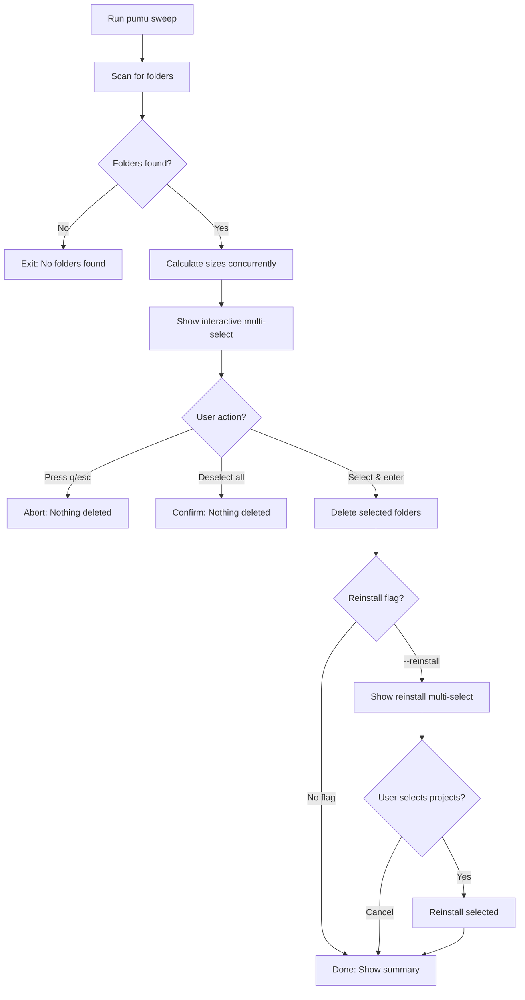

## Overview

Pumu is designed with **safety-first** principles. It includes multiple layers of protection to prevent accidental deletion of critical files, system folders, and active projects.

## Never-Deleted Folders

### System and Cache Directories

From `scanner.go:26-31`, Pumu **never descends into** these directories:

```go
var ignoredPaths = map[string]bool{
    ".Trash": true, ".cache": true, ".npm": true, ".yarn": true,
    ".cargo": true, ".rustup": true, "Library": true, "AppData": true,
    "Local": true, "Roaming": true, ".vscode": true, ".idea": true,
}
```

| Folder | Why It's Protected | Risk if Deleted |
|--------|-------------------|------------------|
| `.git` | Version control | **CRITICAL** - Lose all Git history |
| `.npm`, `.yarn` | Global package caches | Break all npm/yarn projects on system |
| `.cargo`, `.rustup` | Rust global cache | Break all Rust projects |
| `Library` (macOS) | System libraries | OS instability |
| `AppData` (Windows) | Application data | Break installed applications |
| `.vscode`, `.idea` | IDE settings | Lose editor configuration |
| `.cache` | Generic cache | May slow down applications |
| `.Trash` | macOS trash | Unexpected behavior |

<Warning>
**Version control folders like `.git` are hardcoded** to be skipped (see `scanner.go:151`). Pumu will never delete them, even if you try.
</Warning>

### What Pumu Actually Deletes

Only these **regenerable** folders are targeted (from `scanner.go:34-37`):

```go
var deletableTargets = map[string]bool{
    "node_modules": true,
    "target": true,
    ".next": true,
    ".svelte-kit": true,
    ".venv": true,
    "dist": true,
    "build": true,
}
```

<Info>
These folders are safe to delete because they can be **fully regenerated** from:
- Lockfiles (`package-lock.json`, `Cargo.lock`, etc.)
- Source code
- Build configurations
</Info>

## Safety Layers

### 1. Dry-Run Mode

The `list` command **never deletes anything** - it only previews what would be removed.

```bash
pumu list --path ~/projects
```

**Output:**
```
🔎 Listing heavy dependency folders in '~/projects'...
⏱️  Found 3 folders. Calculating sizes concurrently...

Folder Path                                              | Size
-------------------------------------------------------- | ------------
/home/user/projects/webapp/node_modules                  | 487.50 MB ⚠️
/home/user/projects/api/.venv                            | 89.32 MB
/home/user/projects/rust-cli/target                      | 1.23 GB 🚨

📋 List complete! Found 3 heavy folders.
💾 Total space that can be freed: 1.79 GB
```

<Check>
**Best practice:** Always run `pumu list` before `pumu sweep` to preview what will be deleted.
</Check>

### 2. Interactive Selection

By default, `sweep` mode shows an **interactive multi-select** so you choose exactly what to delete (from `scanner.go:107-117`):

```bash
pumu sweep
```

**Interactive prompt:**
```
🗑️  Select folders to delete:
▸ [✓] /home/user/projects/webapp/node_modules       487.50 MB
  [✓] /home/user/projects/rust-cli/target            1.23 GB
  [ ] /home/user/projects/api/.venv                  89.32 MB

  2/3 selected
  press ? for help
```

**Keyboard shortcuts:**

| Key | Action |
|-----|--------|
| `↑` / `k` | Move cursor up |
| `↓` / `j` | Move cursor down |
| `space` | Toggle selection |
| `a` | Select all |
| `n` | Deselect all |
| `i` | Invert selection |
| `enter` | Confirm deletion |
| `q` / `esc` | **Cancel operation** |

<Info>
Pressing `q` or `esc` **aborts the entire operation** - nothing is deleted (see `scanner.go:112-115`).
</Info>

### 3. Explicit `sweep` Command

Pumu requires you to **explicitly use the `sweep` command** to delete anything:

| Command | Behavior |
|---------|----------|
| `pumu` | Refresh current directory (detects package manager) |
| `pumu list` | **Read-only** - no deletions |
| `pumu sweep` | **Deletes** after interactive selection |
| `pumu sweep --no-select` | Deletes all found folders (dangerous) |

<Warning>
The `--no-select` flag **skips interactive selection** and deletes everything immediately. Use with caution.
</Warning>

### 4. Smart Prune Mode

`prune` mode uses a **scoring algorithm** to only delete safe folders (see README:254-293):

```bash
pumu prune
```

**Scoring heuristics:**

| Score | Meaning | Action |
|-------|---------|--------|
| 90-95 | Orphan (no lockfile) or build cache | **Deleted** |
| 60-80 | Stale lockfile (30-90+ days old) | **Deleted** |
| 45 | Normal dependency folder with lockfile | **Deleted** (default threshold ≥ 50) |
| 15-20 | Active project or uncommitted changes | **Skipped** |

**Example output:**
```
🌿 Pruning safely deletable folders in '.'...

Folder Path                          | Size      | Score | Reason
-------------------------------------|-----------|-------|--------
./old-project/node_modules           | 456.78 MB |   95  | 🔴 No lockfile (orphan)
./webapp/.next                       | 234.56 MB |   90  | 🟢 Build cache (re-generable)
./api/node_modules                   | 189.00 MB |   60  | 🟡 Lockfile stale (45 days)
./active-project/node_modules        | 567.89 MB |   20  | ⚪ Active project (skipped)
./wip/target                         | 890.12 MB |   15  | ⚪ Uncommitted changes (skipped)
```

<Check>
**Conservative mode:** Use `--threshold 80` to only delete high-score (orphan) folders.
</Check>

### 5. Concurrent Safety

From `scanner.go:170-190`, Pumu uses **mutexes** and **atomic operations** to prevent race conditions:

```go
var mu sync.Mutex
var folders []TargetFolder

mu.Lock()
folders = append(folders, TargetFolder{Path: p, Size: size})
mu.Unlock()
```

**Why this matters:**
- Multiple goroutines access shared data
- Without locks, concurrent writes could corrupt the folder list
- Atomic operations ensure accurate size tracking during deletion

### 6. Error Handling

Pumu **continues processing** even if individual operations fail (from `scanner.go:183-186`):

```go
size, err := dirSize(p)
if err != nil {
    size = 0  // Set size to 0, but don't stop processing
}
```

**Benefits:**
- One permission error doesn't halt the entire scan
- Partial deletions are tracked accurately
- Failed deletions don't affect successful ones

## Interactive Selection Workflow

Here's the full workflow when you run `pumu sweep`:



### Step-by-Step Safety Checks

1. **Scan phase** - Only deletable targets are found
2. **Size calculation** - Preview before deletion
3. **First selection** - Choose which folders to delete
4. **Deletion** - Only selected folders are removed
5. **Second selection** (if `--reinstall`) - Choose which projects to reinstall
6. **Summary** - Show what was actually deleted

<Info>
You can abort at **any selection screen** by pressing `q` or `esc`. Nothing is deleted until you press `enter` on the first selection.
</Info>

## Recovery Strategies

### If You Accidentally Delete `node_modules`

<Tabs>
  <Tab title="With Lockfile">
    **Safe recovery:**

    ```bash
    cd project
    npm install  # or pnpm install, yarn, etc.
    ```

    **Result:** Exact same dependencies restored from lockfile.
  </Tab>

  <Tab title="Without Lockfile">
    **Risky recovery:**

    ```bash
    npm install  # Installs latest versions
    ```

    **Risk:** May install different versions than before.

    **Best practice:** Always commit lockfiles to version control.
  </Tab>

  <Tab title="Using Git">
    If you committed `node_modules` (not recommended):

    ```bash
    git checkout HEAD -- node_modules/
    ```

    **Note:** This is slow and not recommended. Use lockfiles instead.
  </Tab>
</Tabs>

### If You Delete the Wrong Folder

<Accordion title="I deleted .venv but needed it">
  **Recovery:**
  ```bash
  python -m venv .venv
  source .venv/bin/activate  # or .venv\Scripts\activate on Windows
  pip install -r requirements.txt
  ```

  **Result:** Exact environment restored if `requirements.txt` exists.
</Accordion>

<Accordion title="I deleted target/ and lost debug symbols">
  **Recovery:**
  ```bash
  cargo build  # Rebuilds everything
  ```

  **Result:** Compilation artifacts regenerated. Debug symbols restored.
</Accordion>

<Accordion title="I deleted .next and can't build">
  **Recovery:**
  ```bash
  npm run build  # or yarn build, pnpm build
  ```

  **Result:** `.next` folder regenerated from source code.
</Accordion>

### If You Accidentally Use `--no-select`

**Command:**
```bash
pumu sweep --no-select  # Deletes ALL found folders immediately
```

**Recovery:**
1. **Stay calm** - All deleted folders are regenerable
2. **Check what was deleted** - Review the summary output
3. **Use reinstall** - Run `pumu sweep --reinstall --no-select` to restore everything

**Prevention:**
```bash
pumu list  # Always preview first
```

## What Pumu Will Never Delete

<CardGroup cols={2}>
  <Card title="Version Control" icon="code-branch">
    - `.git/`
    - `.svn/`
    - `.hg/`
  </Card>

  <Card title="Source Code" icon="file-code">
    - `.js`, `.ts`, `.py`, `.go` files
    - `src/`, `lib/`, `components/`
    - Configuration files
  </Card>

  <Card title="Global Caches" icon="database">
    - `~/.npm/`
    - `~/.cargo/`
    - `~/.cache/`
  </Card>

  <Card title="System Folders" icon="folder-tree">
    - `Library/` (macOS)
    - `AppData/` (Windows)
    - `/usr/`, `/etc/`
  </Card>
</CardGroup>

## Safety Checklist

Before running `pumu sweep`, verify:

- [ ] Lockfiles are committed to version control
- [ ] You've run `pumu list` to preview
- [ ] You're in the correct directory
- [ ] You have backups of any custom build configurations
- [ ] You know how to reinstall dependencies for each project

<Warning>
**Never run `pumu sweep` on:**
- Root directory (`/`)
- Home directory (`~`) without `--path` flag
- Unmounted network drives
- Directories without version control
</Warning>

## FAQ

<Accordion title="Can Pumu delete my source code?">
  **No.** Pumu only deletes folders in the `deletableTargets` list:
  
  - `node_modules`, `target`, `.venv`, `.next`, `.svelte-kit`, `dist`, `build`

  Source code files are **never touched**.
</Accordion>

<Accordion title="What if I cancel during deletion?">
  **Partially deleted folders remain deleted.** However:
  
  - Canceling during **selection** = nothing is deleted
  - Canceling during **deletion** = some folders may be partially removed

  **Recovery:** Run reinstall for affected projects.
</Accordion>

<Accordion title="Is it safe to run Pumu on production servers?">
  **No.** Pumu is designed for **development machines**:
  
  - Production should use containerized dependencies
  - Deleting `node_modules` in production causes downtime

  **Use case:** Clean up CI/CD build caches, not live servers.
</Accordion>

<Accordion title="Can I customize ignored paths?">
  **Yes, but requires recompiling:**
  
  1. Edit `internal/scanner/scanner.go:26-31`
  2. Add your paths to `ignoredPaths` map
  3. Run `go build -o pumu`

  **Example:**
  ```go
  var ignoredPaths = map[string]bool{
      ".Trash": true,
      "my-custom-cache": true,  // Add this
  }
  ```
</Accordion>

## See Also

- [Package Manager Detection](/guides/package-managers) - What Pumu recognizes
- [Performance Guide](/guides/performance) - Concurrent scanning details